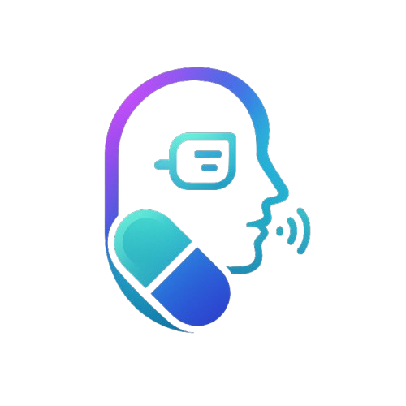
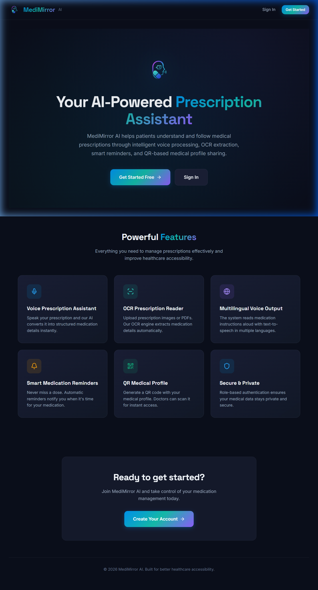

<p align="center">
  
</p>

<h1 align="center">MediMirror AI</h1>

<p align="center">
  <strong>AI-Powered Prescription Assistant for Better Healthcare Accessibility</strong>
</p>

<p align="center">
  
  
  
  
</p>

<p align="center">
  
  
  
</p>

---

## 📋 Table of Contents

- [Overview](#-overview)
- [Problem Statement](#-problem-statement)
- [Solution](#-solution)
- [Key Features](#-key-features)
- [Screenshots](#-screenshots)
- [Tech Stack](#-tech-stack)
- [System Architecture](#-system-architecture)
- [Algorithm & Data Flow](#-algorithm--data-flow)
- [Project Structure](#-project-structure)
- [Database Schema](#-database-schema)
- [API Endpoints](#-api-endpoints)
- [Getting Started](#-getting-started)
- [Environment Variables](#-environment-variables)
- [Target Users](#-target-users)
- [Security](#-security)
- [Implementation Roadmap](#-implementation-roadmap)
- [Expected Impact](#-expected-impact)
- [Contributing](#-contributing)
- [License](#-license)

---

## 🏥 Overview

**MediMirror AI** is an intelligent prescription assistant designed to help patients understand and follow medical prescriptions more effectively, particularly targeting individuals with limited medical literacy.

The system combines **Artificial Intelligence**, **Optical Character Recognition (OCR)**, **Voice Processing**, and **QR-based medical record sharing** to create a comprehensive, intelligent healthcare support platform.

---

## ❗ Problem Statement

Many patients struggle to understand handwritten prescriptions or complex medication instructions provided by doctors. This leads to:

| Problem | Impact |
|---------|--------|
| ❌ Incorrect medication intake | Drug interactions, side effects |
| ❌ Missed doses | Reduced treatment effectiveness |
| ❌ Medication misuse | Health complications |
| ❌ Poor treatment adherence | Prolonged illness |

This problem is especially severe for:

- 👴 **Elderly patients** — difficulty reading small text
- 📖 **Illiterate individuals** — unable to read prescriptions
- 🏘️ **Rural populations** — limited access to pharmacists
- 🌍 **Non-native language speakers** — language barriers

---

## 💡 Solution

MediMirror AI provides an **interactive prescription interpretation system** that:

| Feature | How It Helps |
|---------|-------------|
| 🗣️ Voice Input | Speak prescriptions — no reading required |
| 📷 OCR Scanner | Upload prescription images — AI extracts text |
| 📊 Smart Parsing | Raw text → structured medication table |
| 🔊 Text-to-Speech | Reads instructions aloud in multiple languages |
| ⏰ Smart Reminders | Never miss a dose with automatic alerts |
| 📱 QR Profile | Doctors scan QR code for instant patient access |

---

## ✨ Key Features

### 1. 🗣️ Voice Prescription Assistant
Users speak their prescription instructions and the AI converts speech into structured medication details using the **Web Speech API**.

### 2. 📷 OCR Prescription Reader
Patients upload prescription images (JPG, PNG) or PDFs. The **Tesseract OCR** engine extracts medication text, which is then parsed into structured data.

### 3. 🔊 Multilingual Voice Output
The system detects the language and reads medication instructions aloud using the browser's **SpeechSynthesis API**, supporting multiple languages.

### 4. ⏰ Smart Medication Reminders
Automatic reminders are calculated based on medication frequency. **Browser notifications** alert users when it's time for their dose.

| Frequency | Reminder Intervals |
|-----------|-------------------|
| Once daily | 08:00 |
| Twice daily | 08:00, 20:00 |
| Three times daily | 08:00, 16:00, 00:00 |
| Four times daily | 08:00, 14:00, 20:00, 02:00 |
| At bedtime | 22:00 |

### 5. 📱 QR-Based Medical Profile Sharing
Patients generate a QR code containing their medical profile (name, blood group, allergies, conditions, emergency contact). Doctors scan this QR code to instantly retrieve patient information.

### 6. 🔐 Role-Based Authentication
Separate workflows for **Patients** and **Doctors** with secure authentication via **Supabase Auth**. Doctors can only view patient data via QR scan; patients manage their own records.

---

## 📸 Screenshots

### Landing Page
<p align="center">
  
</p>

> *Premium dark-theme UI with glassmorphism effects, gradient accents, and responsive design.*

### Prescription Processing
Three input modes:
- **Voice** — Tap microphone, speak prescription, get structured data
- **OCR** — Upload prescription image/PDF for automatic extraction  
- **Manual** — Type prescription text directly

### Dashboard
Stats overview with quick actions for voice input, OCR scanning, reminders, and QR profile.

---

## 🛠️ Tech Stack

### Frontend
------------------------------------------------------------
|     Technology      |                Purpose             |
|---------------------|------------------------------------|
| **React 19**        | UI framework                       |
| **TypeScript**      | Type-safe development              |
| **Vite 7**          | Build tool & dev server            |
| **React Router**    | Client-side routing                |
| **Lucide React**    | Premium icon library               |
| **Web Speech API**  | Voice recognition (browser-native) |
| **SpeechSynthesis** | Text-to-speech (browser-native)    |
| **html5-qrcode**    | QR code camera scanning            |
| **qrcode.react**    | QR code rendering                  |
------------------------------------------------------------

### Backend
-----------------------------------------------------
| Technology       | Purpose                        |
|------------------|--------------------------------|
| **Python 3.10+** | Server language                |
| **FastAPI**      | Modern async web framework     |
| **Uvicorn**      | ASGI server                    |
| **pytesseract**  | OCR text extraction            |
| **Pillow (PIL)** | Image processing               |
| **pdf2image**    | PDF to image conversion        |
| **qrcode**       | QR code generation             |
| **Pydantic**     | Data validation & schemas      |
| **python-dotenv**| Environment configuration      |
-----------------------------------------------------

### Database & Auth
------------------------------------------------------
| Technology             | Purpose                   |
|------------------------|---------------------------|
| **Supabase**           | Backend-as-a-Service      |
| **PostgreSQL**         | Relational database       |
| **Supabase Auth**      | User authentication (JWT) |
| **Row Level Security** | Data access control       |
------------------------------------------------------

---

## 🏗️ System Architecture

```
┌──────────────────────────────┐
│       React Frontend         │
│     (TypeScript + Vite)      │
├──────────────────────────────┤
│  Web Speech API  → Voice In  │
│  SpeechSynthesis → Voice Out │
│  html5-qrcode   → QR Scan    │
│  Supabase Client → Auth      │
└──────────┬───────────────────┘
           │ REST API (JSON)
           ▼
┌──────────────────────────────┐
│       FastAPI Backend        │
│         (Python)             │
├──────────────────────────────┤
│  Prescription Parser (Regex) │
│  OCR Service (Tesseract)     │
│  QR Service (qrcode lib)     │
│  Reminder Service            │
└──────────┬───────────────────┘
           │
           ▼
┌──────────────────────────────┐
│         Supabase             │
│       PostgreSQL             │
├──────────────────────────────┤
│  profiles                    │
│  prescriptions               │
│  medications                 │
│  reminders                   │
└──────────────────────────────┘
```

### Component Diagram

```
User Interface
      │
      ▼
Frontend Web Application
      │
      ├── Voice Processing Module
      ├── OCR Extraction Module
      ├── Prescription Parsing Engine
      ├── Reminder System
      │
      ▼
FastAPI Backend
      │
      ├── Authentication
      ├── Supabase Database
      │
      ▼
Doctor Access System
  (QR Code Scan)
```

---

## 🧠 Algorithm & Data Flow

### Data Flow Pipeline

```
1. INPUT     → User speaks / uploads image / types text
2. EXTRACT   → Speech-to-text (Web Speech API) or OCR (Tesseract)
3. PARSE     → Regex engine extracts medicine, dose, frequency, timing, duration
4. STORE     → Prescription + medications saved to Supabase
5. REMIND    → Frequency → time intervals → browser notifications
6. SHARE     → QR code generated → Doctor scans → Patient profile access
```

### Prescription Parsing Algorithm

The smart parser uses **regex pattern matching** to extract:

-----------------------------------------------------------------------------------------
| Attribute         |            Pattern Examples           |          Output           |
|-------------------|---------------------------------------|---------------------------|
| **Medicine Name** | Tab. Paracetamol, Cap. Amoxicillin    | Paracetamol, Amoxicillin  |
| **Dosage**        | `500mg`, `10ml`, `250mcg`             | 500 mg                    |
| **Frequency**     | `twice daily`, `TID`, `every 8 hours` | twice daily               |
| **Timing**        | `before meals`, `after food`, `AC`    | before_meal               |
| **Duration**      | `for 5 days`, `2 weeks`               | 5 days                    |
-----------------------------------------------------------------------------------------

### Key Regex Patterns

```python
# Dosage detection
r"(\d+(?:\.\d+)?\s*(?:mg|ml|mcg|g|IU|tablets?))"

# Frequency detection
r"\btwice\s+(?:a\s+)?daily\b"        → "twice daily"
r"\b[tT][iI][dD]\b"                  → "three times daily"
r"\bevery\s+(\d+)\s+hours?\b"        → "every N hours"

# Timing detection
r"\bbefore\s+(?:food|meals?)\b"      → "before_meal"
r"\bafter\s+(?:food|meals?)\b"       → "after_meal"

# Duration detection
r"(?:for)\s+(\d+)\s*(days?|weeks?|months?)"
```

### Reminder Scheduling Algorithm

```
For each medication:
    Read frequency
    Convert frequency to time intervals
    Schedule reminder notifications
    Notify user when time occurs
```

| Frequency         | Interval | Times Per Day |
|-------------------|----------|:-------------:|
| Once daily        | 24 hours |      1        |
| Twice daily       | 12 hours |      2        |
| Three times daily | 8 hours  |      3        |
| Four times daily  | 6 hours  |      4        |

---

## 📁 Project Structure

```
MEDIMIRROR-GCET 2025/
│
├── frontend/                          # React TypeScript Application
│   ├── public/
│   │   └── logo.png                   # App logo/favicon
│   ├── src/
│   │   ├── components/                # Reusable UI components
│   │   │   ├── Navbar.tsx             # Navigation bar (role-based)
│   │   │   ├── MedicationTable.tsx    # Medication display with TTS
│   │   │   └── ProtectedRoute.tsx     # Auth guard component
│   │   ├── pages/                     # Application pages
│   │   │   ├── LandingPage.tsx        # Public landing with features
│   │   │   ├── LoginPage.tsx          # User sign in
│   │   │   ├── SignupPage.tsx         # Registration (patient/doctor)
│   │   │   ├── DashboardPage.tsx      # Main dashboard
│   │   │   ├── PrescriptionsPage.tsx  # Voice / OCR / Manual input
│   │   │   ├── RemindersPage.tsx      # Medication reminders
│   │   │   ├── QRProfilePage.tsx      # QR code generation
│   │   │   ├── ProfilePage.tsx        # User profile management
│   │   │   └── DoctorScanPage.tsx     # Doctor QR scanner
│   │   ├── context/
│   │   │   └── AuthContext.tsx        # Authentication state
│   │   ├── hooks/
│   │   │   └── useSpeech.ts           # Speech recognition & TTS
│   │   ├── services/
│   │   │   ├── api.ts                 # REST API client
│   │   │   └── supabaseClient.ts      # Supabase initialization
│   │   ├── types/
│   │   │   └── index.ts              # TypeScript definitions
│   │   ├── index.css                  # Premium design system
│   │   ├── App.tsx                    # Root with React Router
│   │   └── main.tsx                   # Entry point
│   ├── .env.example
│   ├── index.html
│   └── package.json
│
├── backend/                           # Python FastAPI Application
│   ├── app/
│   │   ├── routers/                   # API route handlers
│   │   │   ├── auth.py                # Authentication endpoints
│   │   │   ├── prescriptions.py       # Prescription CRUD + OCR
│   │   │   ├── reminders.py           # Reminder management
│   │   │   └── qr.py                  # QR code operations
│   │   ├── models/
│   │   │   └── schemas.py             # Pydantic data models
│   │   ├── services/                  # Business logic layer
│   │   │   ├── supabase_service.py    # Database operations
│   │   │   ├── prescription_parser.py # Regex-based parser
│   │   │   ├── ocr_service.py         # Tesseract OCR
│   │   │   ├── qr_service.py          # QR generation/decoding
│   │   │   └── reminder_service.py    # Reminder scheduling
│   │   └── config.py                  # Settings management
│   ├── main.py                        # FastAPI entry point
│   ├── schema.sql                     # Supabase DB schema
│   ├── requirements.txt               # Python dependencies
│   └── .env.example
│
├── docs/                              # Documentation
│   ├── PROJECT.md                     # Overall project docs
│   ├── FRONTEND.md                    # Frontend documentation
│   └── BACKEND.md                     # Backend documentation
│
├── assets/
│   └── logo.png                       # Project logo
│
└── README.md                          # This file
```

---

## 🗃️ Database Schema

The Supabase PostgreSQL database contains 4 tables with Row Level Security:

### Tables

#### `profiles`
| Column | Type | Description |
|--------|------|-------------|
| id | UUID (PK) | References auth.users |
| email | TEXT | User email (unique) |
| full_name | TEXT | Display name |
| role | TEXT | `patient` or `doctor` |
| phone | TEXT | Phone number |
| date_of_birth | TEXT | Date of birth |
| blood_group | TEXT | Blood type (A+, B-, O+, etc.) |
| allergies | TEXT | Known allergies |
| medical_conditions | TEXT | Existing conditions |
| emergency_contact | TEXT | Emergency contact info |

#### `prescriptions`
| Column | Type | Description |
|--------|------|-------------|
| id | UUID (PK) | Auto-generated |
| user_id | UUID (FK) | References profiles |
| raw_text | TEXT | Original prescription text |
| source | TEXT | `manual`, `voice`, or `ocr` |
| created_at | TIMESTAMPTZ | Timestamp |

#### `medications`
| Column | Type | Description |
|--------|------|-------------|
| id | UUID (PK) | Auto-generated |
| prescription_id | UUID (FK) | References prescriptions |
| medicine_name | TEXT | Name of medication |
| dosage | TEXT | Dosage info (e.g., 500mg) |
| frequency | TEXT | How often (e.g., twice daily) |
| timing | TEXT | `before_meal`, `after_meal`, `with_meal`, `anytime` |
| duration | TEXT | Treatment duration (e.g., 7 days) |

#### `reminders`
| Column | Type | Description |
|--------|------|-------------|
| id | UUID (PK) | Auto-generated |
| user_id | UUID (FK) | References profiles |
| prescription_id | UUID (FK) | References prescriptions |
| medication_name | TEXT | Medication name |
| frequency | TEXT | Dosing frequency |
| times | TEXT[] | Array of HH:MM times |
| is_active | BOOLEAN | Active status |

### Entity Relationship

```
profiles (1) ──→ (N) prescriptions
prescriptions (1) ──→ (N) medications
profiles (1) ──→ (N) reminders
```

---

## 🔌 API Endpoints

The FastAPI backend runs at `http://localhost:8000` with full Swagger docs at `/docs`.

### Authentication — `/api/auth`

--------------------------------------------------------------
| Method |          Endpoint             |    Description    |
|--------|-------------------------------|-------------------|
| `POST` | `/api/auth/signup`            | Register new user |
| `POST` | `/api/auth/signin`            | Sign in user      |
| `GET`  | `/api/auth/profile`           | Get own profile   |
| `PUT`  | `/api/auth/profile`           | Update profile    |
| `GET`  | `/api/auth/profile/{user_id}` | Get profile by ID |
--------------------------------------------------------------

### Prescriptions — `/api/prescriptions`

------------------------------------------------------------------------------
|   Method  |           Endpoint            |       Description              | 
------------------------------------------------------------------------------
| `POST`    | `/api/prescriptions/parse`    | Parse text → medications       |
| `POST`    | `/api/prescriptions/ocr`      | Upload image/PDF → OCR extract |
| `POST`    | `/api/prescriptions/`         | Save prescription              |
| `GET`     | `/api/prescriptions/`         | List all prescriptions         |
| `GET`     | `/api/prescriptions/{id}`     | Get single prescription        |
| `DELETE`  | `/api/prescriptions/{id}`     | Delete prescription            |
------------------------------------------------------------------------------

### Reminders — `/api/reminders`
------------------------------------------------------------------------------
|   Method  |           Endpoint             |       Description              | 
|-----------------------------------------------------------------------------|
| `POST`    | `/api/reminders/`              | Create reminder                |
| `GET`     | `/api/reminders/`              | List active reminders          |
| `PUT`     | `/api/reminders/{id}`          | Update reminder                |
| `DELETE`  | `/api/reminders/{id}`          | Delete reminder                |
| `POST`    | `/api/reminders/auto-generate` | Auto-create from prescription  |
------------------------------------------------------------------------------

### QR Code — `/api/qr`
---------------------------------------------------------------------------------
|   Method  |           Endpoint            |       Description                 | 
|-------------------------------------------------------------------------------|
| `POST`    | `/api/qr/generate`             | Generate patient QR              |
| `GET`     | `/api/qr/patient/{id}`         | Get patient data (doctor only)   |
| `POST`    | `/api/qr/decode`               | Decode QR content                |
---------------------------------------------------------------------------------

---

## 🚀 Getting Started

### Prerequisites

| Requirement | Version |
|-------------|---------|
| Node.js     | v18+    |
| npm         | v9+     |
| Python      | v3.10+  |
| Tesseract OCR | Latest |
| Supabase Account | Free tier works |

### Step 1: Clone the Repository

```bash
git clone https://github.com/your-username/medimirror-ai.git
cd medimirror-ai
```

### Step 2: Setup Supabase Database

1. Create a new project at [supabase.com](https://supabase.com)
2. Go to **SQL Editor** → New Query
3. Copy and paste the contents of `backend/schema.sql`
4. Click **Run** to create all tables, policies, and triggers
5. Go to **Settings → API** and copy your:
   - Project URL
   - `anon` public key
   - `service_role` key

### Step 3: Setup Backend

```bash
# Navigate to backend
cd backend

# Create Python virtual environment
python -m venv venv

# Activate virtual environment
venv\Scripts\activate          # Windows
# source venv/bin/activate     # macOS/Linux

# Install dependencies
pip install -r requirements.txt

# Create environment file
copy .env.example .env         # Windows
# cp .env.example .env         # macOS/Linux

# Edit .env with your Supabase credentials
# SUPABASE_URL=https://your-project.supabase.co
# SUPABASE_KEY=your-anon-key
# SUPABASE_SERVICE_ROLE_KEY=your-service-role-key
# TESSERACT_CMD=C:\Program Files\Tesseract-OCR\tesseract.exe

# Start the backend server
python main.py
```

✅ Backend runs at: `http://localhost:8000`
📖 API docs at: `http://localhost:8000/docs`

### Step 4: Setup Frontend

```bash
# Navigate to frontend (open new terminal)
cd frontend

# Install dependencies
npm install

# Create environment file
copy .env.example .env         # Windows
# cp .env.example .env         # macOS/Linux

# Edit .env with your configuration
# VITE_SUPABASE_URL=https://your-project.supabase.co
# VITE_SUPABASE_ANON_KEY=your-anon-key
# VITE_API_URL=http://localhost:8000/api

# Start development server
npm run dev
```

✅ Frontend runs at: `http://localhost:5173`

### Step 5: Install Tesseract OCR (for prescription image scanning)

**Windows:**
Download and install from: https://github.com/UB-Mannheim/tesseract/wiki

**macOS:**
```bash
brew install tesseract
```

**Linux (Ubuntu/Debian):**
```bash
sudo apt install tesseract-ocr
```

---

## 🔐 Environment Variables

### Backend (`backend/.env`)
```env
SUPABASE_URL=https://your-project.supabase.co
SUPABASE_KEY=your-anon-key
SUPABASE_SERVICE_ROLE_KEY=your-service-role-key
TESSERACT_CMD=C:\Program Files\Tesseract-OCR\tesseract.exe
```

### Frontend (`frontend/.env`)
```env
VITE_SUPABASE_URL=https://your-project.supabase.co
VITE_SUPABASE_ANON_KEY=your-anon-key
VITE_API_URL=http://localhost:8000/api
```

---

## 👥 Target Users

| User Type | Primary Features | Use Case |
|-----------|-----------------|----------|
| 👨‍⚕️ **Doctors** | QR scan, patient profiles | Quick access to patient medical data |
| 🏥 **Patients** | Voice, OCR, reminders, QR | Understand & follow prescriptions |
| 👴 **Elderly** | Voice input, TTS output | No reading required |
| 🏘️ **Rural** | Simple UI, voice-first | Low digital literacy support |
| 🏨 **Hospitals** | QR system, profiles | Streamlined patient management |

---

## 🔒 Security

| Feature | Implementation |
|---------|---------------|
| **Authentication** | Supabase Auth (JWT tokens) |
| **Row Level Security** | Users access only their own data |
| **Role-based access** | Patient/Doctor separation at API level |
| **CORS protection** | Whitelisted origins only |
| **Input validation** | Pydantic models for all API inputs |
| **Secure storage** | Environment variables for secrets |

---

## 📅 Implementation Roadmap

| Phase | Description | Status |
|-------|-------------|:---:|
| Phase 1 | Requirement Analysis & Architecture | ✅ |
| Phase 2 | UI Development (React TypeScript) | ✅ |
| Phase 3 | Authentication System (Supabase Auth) | ✅ |
| Phase 4 | Prescription Processing Engine (Voice + OCR + Parser) | ✅ |
| Phase 5 | Medication Reminder System | ✅ |
| Phase 6 | QR Medical Profile System | ✅ |
| Phase 7 | Testing & Optimization | 🔄 |
| Phase 8 | Deployment | 📋 |

---

## 🌟 Expected Impact

MediMirror AI aims to improve:

- ✅ **Patient medication adherence** — structured instructions + reminders
- ✅ **Healthcare accessibility** — voice-first, multilingual support
- ✅ **Doctor-patient communication** — QR-based instant data sharing
- ✅ **Digital healthcare adoption** — simple, intuitive interface
- ✅ **Treatment outcomes** — fewer missed doses and medication errors

---

## 📚 Documentation

Detailed documentation is available in the `docs/` folder:

| Document | Description |
|----------|-------------|
| [PROJECT.md](docs/PROJECT.md) | Overall project documentation |
| [FRONTEND.md](docs/FRONTEND.md) | Frontend architecture, components, pages, hooks |
| [BACKEND.md](docs/BACKEND.md) | Backend API endpoints, services, database schema |

---

## 🤝 Contributing

1. Fork the repository
2. Create your feature branch (`git checkout -b feature/AmazingFeature`)
3. Commit changes (`git commit -m 'Add AmazingFeature'`)
4. Push to branch (`git push origin feature/AmazingFeature`)
5. Open a Pull Request

---

## 📄 License

This project was developed for the **GCET 2025 Hackathon**.

---

<p align="center">
  
  <br />
  <strong>MediMirror AI — Making Healthcare Accessible Through Technology</strong>
  <br />
  <sub>Built with ❤️ for better patient outcomes</sub>
</p>
