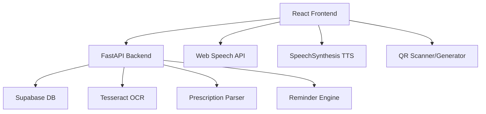

# MediMirror AI — Implementation Plan

## Overview
MediMirror AI is an AI-powered prescription assistant that helps patients understand and follow medical prescriptions. The system combines AI, OCR, Voice Processing, and QR-based medical record sharing.

## Tech Stack
| Layer | Technology |
|-------|-----------|
| Frontend | React (TypeScript) + Vite |
| Backend | Python (FastAPI) |
| Database | Supabase (PostgreSQL + Auth) |
| OCR | Tesseract (pytesseract) |
| Voice | Web Speech API (browser) |
| TTS | Browser SpeechSynthesis API |
| QR | qrcode (Python) + html5-qrcode (JS) |

## Architecture



## Project Structure

```
MEDIMIRROR-GCET 2025/
├── frontend/          # React TypeScript app
│   ├── src/
│   │   ├── components/
│   │   ├── pages/
│   │   ├── hooks/
│   │   ├── services/
│   │   ├── types/
│   │   └── utils/
│   └── public/
├── backend/           # Python FastAPI
│   ├── app/
│   │   ├── routers/
│   │   ├── models/
│   │   ├── services/
│   │   └── utils/
│   ├── requirements.txt
│   └── main.py
└── docs/              # Documentation
    ├── PROJECT.md
    ├── FRONTEND.md
    └── BACKEND.md
```

## Key Features
1. **Voice Prescription Assistant** — Speak prescriptions, get structured data
2. **OCR Prescription Reader** — Upload images/PDFs, extract medication details
3. **Multilingual Voice Output** — Text-to-speech in detected language
4. **Smart Medication Reminders** — Automatic dose reminders
5. **QR Medical Profile Sharing** — Generate/scan QR for patient profiles
6. **Role-based Auth** — Patient & Doctor roles via Supabase Auth

## Implementation Phases
1. Backend setup (FastAPI + Supabase integration)
2. Frontend setup (React + TypeScript + Vite)
3. Authentication (Supabase Auth)
4. Prescription processing (OCR + Voice + Parser)
5. Reminder system
6. QR profile system
7. Documentation (.md files)
