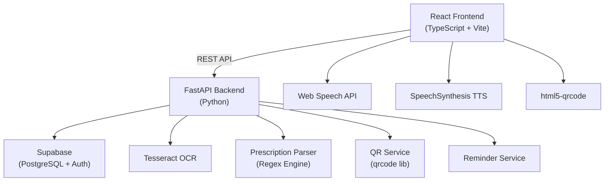

# MediMirror AI — Project Walkthrough

## What Was Built

A complete full-stack **MediMirror AI** application — an AI-powered prescription assistant for better healthcare accessibility.


---

## Architecture



### Documentation — 3 files
| File | Purpose |
|------|---------|
| [docs/PROJECT.md](file:///d:/HACKATHONS/MEDIMIRROR-GCET%202025/docs/PROJECT.md) | Overall project documentation |
| [docs/FRONTEND.md](file:///d:/HACKATHONS/MEDIMIRROR-GCET%202025/docs/FRONTEND.md) | Frontend architecture & components |
| [docs/BACKEND.md](file:///d:/HACKATHONS/MEDIMIRROR-GCET%202025/docs/BACKEND.md) | Backend API & services documentation |

---

## How to Run

### 1. Setup Supabase
- Create project at [supabase.com](https://supabase.com)
- Run [backend/schema.sql](file:///d:/HACKATHONS/MEDIMIRROR-GCET%202025/backend/schema.sql) in SQL Editor
- Copy project URL and API keys

### 2. Start Backend
```bash
cd backend
python -m venv venv && venv\Scripts\activate
pip install -r requirements.txt
# Copy .env.example to .env and add Supabase credentials
python main.py
# → http://localhost:8000 (docs at /docs)
```

### 3. Start Frontend  
```bash
cd frontend
npm install
# Copy .env.example to .env and add Supabase/API URLs
npm run dev
# → http://localhost:5173
```

---

## Key Features Implemented
1. ✅ **Voice Prescription Input** — Web Speech API recognition
2. ✅ **OCR Prescription Reader** — Tesseract image/PDF extraction
3. ✅ **Manual Text Entry** — Direct prescription typing
4. ✅ **Smart Parsing Engine** — Regex-based medication extraction
5. ✅ **Text-to-Speech** — Read medications aloud
6. ✅ **Medication Reminders** — Frequency-based scheduling with notifications
7. ✅ **QR Medical Profile** — Generate/download/scan patient QR codes
8. ✅ **Role-based Auth** — Patient & Doctor roles with Supabase
9. ✅ **Premium Dark UI** — Glassmorphism, gradients, animations
10. ✅ **Responsive Design** — Mobile-friendly layout
